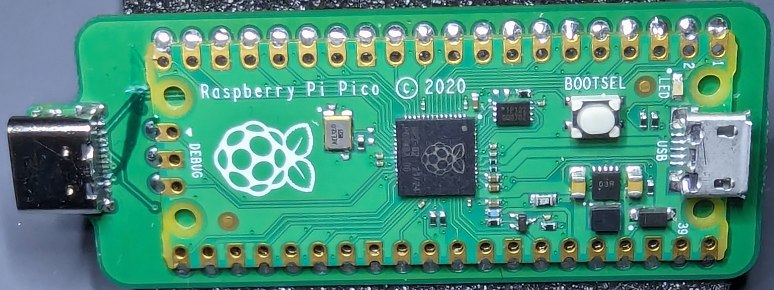

# picoPD_interrogator - Rev A & B

The images shown above are **Rev A** - not Rev B...
Rev B looks similar - lacking the tiny wire bodges seen above. 

# Concept behind this PCBA
- Original idea was to use the Flipper Zero as the user interface - I was planning to write an application that would talk to the board over serial. 
- Flipper would also work as a debug probe for the Pico
- Flipper would also power the Pico

# Usage
- Board requires power to operate the USB-PD functionality. This PCBA lacks an on-board regulator to power the Pico - so this board must be powered externally. (likely via either a Flipper Zero or USB power on the Pico micro-USB connector)
- Connecting to the Pico's micro-USB port provides a CDC-ACM (USB Serial COM port) shell interface. You can use Putty (Windows) or something like screen or minicom (Linux/macOS) to access it. 