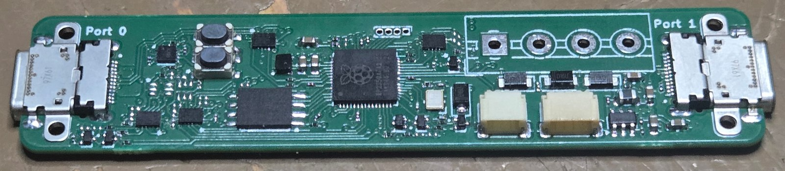

# picoPD_interrogator - Rev C ** NOT RECOMMENDED - DO NOT BUILD **

# Multi-port experiment - major issues
This version was designed with two USB-C ports. This was **mostly** a failure. Here is what I learned.
- Found during evaluation that the analog switches don't connect anything unless they are powered. (So they don't actually act like relays - which was a bad assumption on my end...)
- Analog switches used were no good for switching USB 1.1/2.0 data lines. (I figured during PCB design that this would work for USB 1.1 - but that was not the case.)

## Port 1
- (**Theoretically** - see above) Connects to RP2350 MCU for USB 1.1 full-speed data
- (**Theoretically** - see above) Allows pass-through of USB data to Port 2

## Port 2
- (**Theoretically** - see above) Connects to RP2350 PIO implementation of USB
- (Theoretically - see above) Allows passthrough of USB data to Port 1

Each of the ports above had a single BMC RX/TX channel - which would be switched between CC1/CC2 of the same port. Unlike RevA/B - each port only had one CC channel that would have to be shared between the pins. Connector plug orientation would need to be determined to route the CC channel to the correct pins. 

# Concept behind this experiment
- Provide customizable PDOs on Port 2 - and use Port 1 to source power from a charger
- Allow experimentation with modifying PDOs provided by a charger - possibly even 'simulating' other adapters (such as the odd-ball RPI5 fixed-PDO 5V/5A charger) with upstream being SPR PPS. (Some chargers can provide high-current even with low-voltage in PPS mode)

# Future plans for this model?
- I may redesign this 2-port concept later to fix the issues encountered - but right now I've got to focus on getting a more stable USB-PD PHY - there are other challenges that are higher-priority within this project.