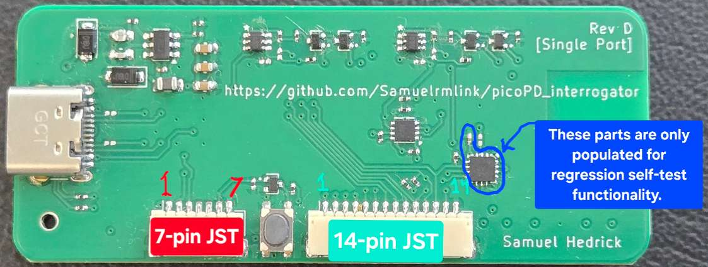
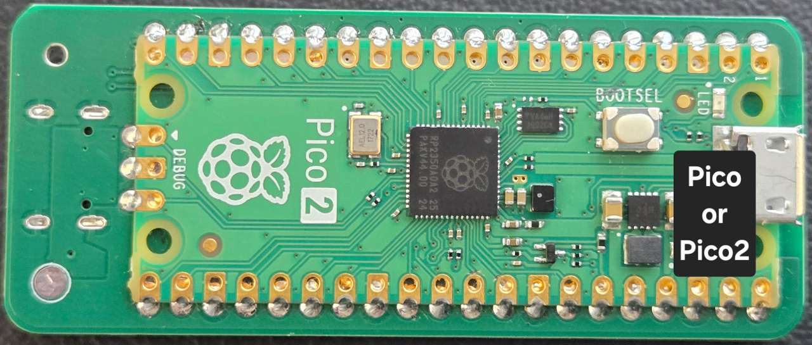

# picoPD_interrogator - Rev D

# Single-port standalone variant
- Implements a single USB-C port - with two CC channels. (One channel per USB-C CC pin - so flipping plug orientation results in a different CC channel being utilized.)
- Optional 'FUSB302B' protocol chip - which can be populated to allow for self-testing. 
- On-Board voltage regulator - theoretically this should handle up to 50V DC - but if you received a sample board from me at DC33 (Defcon 33) I populated capacitors that were not rated for above 25v (DigiKey order had not arrived before PCB assembly) - so don't try to request EPR voltages. 

# Modifying the PCB
- I found that GP26 and GP27 would draw current and drop the voltage on CC1 and CC2 resulting in the charger not powering the board in some cases. This issue can be resolved by isolating the GP26 and GP27 pads where the Pico mounts. 
- Cut the tracks right at the edge of the GP26 and GP27 pads.

# 7-pin JST pinout
| JST Pin # | 1   | 2       | 3      | 4        | 5        | 6          | 7   |
| --------- | --- | ------- | ------ | -------- | -------- | ---------- | --- |
| Function  | 3v3 | SWD_CLK | SWD_IO | UART0_RX | UART0_TX | PICO_RESET | GND |

# 14-pin JST pinout
| JST Pin # | 1   | 2        | 3         | 4         | 5    | 6    | 7    | 8    | 9    | 10  | 11  | 12       | 13      | 14  |
| --------- | --- | -------- | --------- | --------- | ---- | ---- | ---- | ---- | ---- | --- | --- | -------- | ------- | --- |
| Function  | 3v3 | SPI0_CLK | SPI0_MOSI | SPI0_MISO | GP15 | GP16 | GP17 | GP18 | GP19 | SDA | SCL | TCPC_INT | GP28_A2 | GND |

